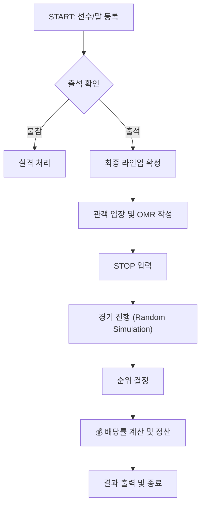

# 🐎 Horse Racing Management System (경마 관리 시스템 요구사항)

이 프로젝트는 선수 및 경주마의 등록부터 경기 진행, 그리고 관객의 베팅과 배당금 정산까지 경마의 전 과정을 시뮬레이션하는 프로그램입니다.

### 1. 선수 및 경주마 등록 (Registration)

경기에 참가할 선수와 말의 정보를 데이터베이스에 등록합니다.

- **입력:** 선수 이름과 말 이름을 쌍으로 입력받습니다.
- **제약 조건:**
  - 이름은 오직 **문자**로만 구성되어야 합니다.
  - 선수 이름과 말 이름에 **중복**이 있어서는 안 됩니다.
- **종료:** `0` 을 입력하면 등록 절차가 마감됩니다.

### 2. 출석 체크 (Attendance Check)

등록된 명단을 바탕으로 실제 경기에 참여할 인원을 확정합니다.

- **검증 로직:** 입력된 {선수, 말} 조합이 등록된 명단과 정확히 일치해야 합니다.
- **예외 처리:**
  - 명단에 없는 조합 입력 시 `[Error]` 메시지를 출력하고 재입력을 요구합니다.
  - 오지 않은 선수는 **실격 처리**됩니다.
- **자동 진행:** 등록된 모든 선수가 출석할 경우, 종료 커맨드(`0`) 없이 즉시 다음 단계로 넘어갑니다.

### 3. 관객 입장 및 베팅 (Spectators & Betting)

관객은 입장료를 지불하고 다양한 방식(승식)으로 경주마에 베팅할 수 있습니다.

#### 🎟️ 입장 관리

- **입장료:** 기본 2,000원.
- **잔돈 처리:** 2,000원 초과 금액 입력 시 잔돈을 계산하여 반환합니다.

#### 📝 OMR 베팅 시스템

관객은 아래 4가지 승식 중 하나를 선택하여 베팅합니다.

|   승식   | 설명                                          | 선택 말 수 |
| :------: | :-------------------------------------------- | :--------: |
| **단승** | 1등으로 들어올 말 1마리를 맞춤                |     1      |
| **연승** | 3등 안에 들어올 말 1마리를 맞춤               |     1      |
| **복승** | 2등 안에 들어올 말 2마리를 순서 상관없이 맞춤 |     2      |
| **쌍승** | 1등과 2등 말을 **순서대로** 맞춤              |     2      |

- **베팅 규칙:**
  - 베팅금은 **1,000원 단위**로만 가능하며, 1,000원 미만은 불가합니다.
  - 승식에 맞지 않는 마리 수를 입력할 경우(예: 단승에 2마리 입력), 관객 이름 입력부터 다시 시작합니다.
- **종료:** `STOP` 입력 시 관객 입장을 마감합니다.

### 4. 경기 진행 (Race Simulation)

경주마들이 결승선을 향해 달리는 시뮬레이션 단계입니다.

- **승리 조건:** 총 **5칸**을 먼저 전진한 순서대로 순위가 결정됩니다.
- **이동 로직:**
  - 각 턴마다 $1 \sim 45$ 사이의 숫자를 랜덤하게 생성합니다.
  - 생성된 숫자가 $25$ 보다 클 경우 ($Random > 25$ ) **1칸 전진**합니다.
  - 그 외의 경우 제자리에 머무릅니다.

### 5. 정산 및 결과 출력 (Settlement)

경기가 종료된 후 배당률을 계산하고 최종 수익을 출력합니다.

#### 💰 배당률 계산 공식 (Dividend Formula)

배당률은 승식별로 독립적으로 계산됩니다.

$$
\text{배당률} = \frac{\text{총 베팅 풀 (Total Betting Pool)}}{\text{승리 풀 (Winning Pool)}}
$$

- **총 베팅 풀:** 해당 승식에 걸린 모든 돈의 합.
- **승리 풀:** 결과를 맞춘 사람들이 건 돈의 합.

#### 📊 최종 리포트

모든 참가자에 대해 다음 정보를 순서대로 출력합니다:
`[관객 이름]`, `[승식]`, `[베팅금]`, `[선택한 말]`, `[최종 수익]`

- 예측 실패 시 베팅금은 전액 몰수(수익 0원 또는 손실)됩니다.

## 🔄 프로세스 흐름 (Process Flow)

프로그램은 **[등록] → [검증] → [베팅] → [경기] → [정산]** 의 5단계 순환 구조를 가집니다.

### 1. 선수 및 경주마 등록 (Registration)

관리자는 경기에 참여할 선수와 말의 정보를 사전에 입력하여 시스템에 초기화합니다.

- **Input:** `선수이름,말이름` (쉼표로 구분된 문자열)
- **Action:** 입력된 데이터를 검증 후 예비 명단(Roster)에 저장

### 2. 출석 정보 확인 (Attendance Verification)

경기 당일, 저장된 명단을 바탕으로 실제 경기장에 도착한 인원을 파악합니다.

- **Validation:** 등록된 정보와 정확히 일치하는지 대조
- **Result:** 출석하지 않은 선수는 실격 처리 및 최종 경기 라인업에서 제외

### 3. 관객 정보 입력 및 저장 (Betting Phase)

경기를 관람할 관객들의 입장과 베팅(OMR) 정보를 수집합니다.

- **Process:**
  1. 입장료 결제 및 거스름돈 반환
  2. 관객의 이름을 입력
  3. 관객별 OMR 카드 작성 (승식, 선택한 말, 베팅 금액)
  4. 입력 데이터 유효성 검사

### 4. 경주 진행 (Race Simulation)

경주가 시작되면 매 턴(Turn)마다 무작위 확률로 말들이 움직입니다.

- **Logic:** $1 \sim 45$ 사이의 난수를 생성하여 전진 여부 결정 ($>25$ 일 경우 전진)
- **Display:** 매 턴 경기 현황을 실시간으로 출력
- **Finish:** 결승선(5칸) 통과 순서에 따라 최종 순위 산정

### 5. 정산 및 결과 리포트 (Settlement & Reporting)

경기 결과와 관객들의 베팅 정보를 대조하여 수익을 계산합니다.

- **Calculation:** 전체 베팅 풀(Pool)과 승리 풀을 기반으로 승식별 배당률 산출
- **Output:**
  - 경기 최종 순위
  - 관객별 베팅 결과 및 최종 수익금 출력



    🖥️ 실행 예시 (Input/Output Example)

실제 프로그램 구동 시나리오입니다. 아래 탭을 눌러 상세 내용을 확인하세요.

<details>
<summary>🖱️ <b>여기를 클릭하여 실행 로그 확인하기 (Click to expand)</b></summary>

```text
[Step 1: 선수 및 경주마 등록]
선수와 말을 입력해주세요. 종료를 원한다면 0을 입력해주세요
> minuk,bobby
선수와 말을 입력해주세요. 종료를 원한다면 0을 입력해주세요
> yeanjun,js
선수와 말을 입력해주세요. 종료를 원한다면 0을 입력해주세요
> seunhun,java
선수와 말을 입력해주세요. 종료를 원한다면 0을 입력해주세요
> jun,scrip
선수와 말을 입력해주세요. 종료를 원한다면 0을 입력해주세요
> 0

[Step 2: 출석 체크]
경기장에 도착한 선수와 말을 입력해주세요. 종료를 원한다면 0을 입력해주세요.

> minuk,bobby
> minuk 출석 완료
> 경기장에 도착한 선수와 말을 입력해주세요. 종료를 원한다면 0을 입력해주세요.
> yeanjun,js
> yeanjun 출석 완료
> 경기장에 도착한 선수와 말을 입력해주세요. 종료를 원한다면 0을 입력해주세요.
> seunhun,java
> seunhun 출석 완료
> 경기장에 도착한 선수와 말을 입력해주세요. 종료를 원한다면 0을 입력해주세요.
> jun,scrip
> jun 출석 완료

모든 선수가 출석이 완료되었습니다.

<<선수 출석 명단>>
선수: minuk, 말: bobby : 출석
선수: yeanjun, 말: js : 출석
선수: seunhun, 말: java : 출석
선수: jun, 말: scrip : 출석

[Step 3: 관객 입장 및 베팅]
입장료를 내주세요. 종료를 원한다면 STOP를 입력해주세요!

> 2000
> 잔돈은 0원입니다.

관객의 이름을 입력해주세요.

> minuk
> OMR을 작성해주세요. 승식/베팅금/선택한 말 순으로 기입해주세요
> 단승/2000/bobby

입장료를 내주세요. 종료를 원한다면 STOP를 입력해주세요!

> 연승/2000/js
> [Error] 입장금에는 숫자만 기입해주세요.

입장료를 내주세요. 종료를 원한다면 STOP를 입력해주세요!

> 2000
> 잔돈은 0원입니다.

관객의 이름을 입력해주세요.

> alsdnr
> OMR을 작성해주세요. 승식/베팅금/선택한 말 순으로 기입해주세요
> 연승/30000/js

입장료를 내주세요. 종료를 원한다면 STOP를 입력해주세요!

> 2000
> 잔돈은 0원입니다.

관객의 이름을 입력해주세요.

> KMU
> OMR을 작성해주세요. 승식/베팅금/선택한 말 순으로 기입해주세요
> 복승/30000/java,scrip

입장료를 내주세요. 종료를 원한다면 STOP를 입력해주세요!

> 40000
> 잔돈은 38000원입니다.

관객의 이름을 입력해주세요.

> HJ
> OMR을 작성해주세요. 승식/베팅금/선택한 말 순으로 기입해주세요
> 쌍승/20000/bobby,java

입장료를 내주세요. 종료를 원한다면 STOP를 입력해주세요!

> STOP

<<관객들의 정보>>
이름: minuk, 승식: 단승, 베팅금 :2000, 선택한 말 :bobby
이름: alsdnr, 승식: 연승, 베팅금 :30000, 선택한 말 :js
이름: KMU, 승식: 복승, 베팅금 :30000, 선택한 말 :java,scrip
이름: HJ, 승식: 쌍승, 베팅금 :20000, 선택한 말 :bobby,java

[총 배팅 금액 현황]

- 단승: 2000원
- 연승: 30000원
- 복승: 30000원
- 쌍승: 20000원

[Step 4: 경기 진행]
<<경기 시작!>>

bobby :
js :
java : -
scrip : -
...(중략)...
bobby : -----
js : -----
java : -----
scrip : -----

[Step 5: 최종 결과]
<<경기 결과>>
1등: java
2등: scrip
3등: js
4등: bobby

<<관객들의 베팅 결과>>
이름: minuk, 승식: 단승, 베팅금: 2000, 선택한 말: bobby, 수익: 0
이름: alsdnr, 승식: 연승, 베팅금: 30000, 선택한 말: js, 수익: 30000
이름: KMU, 승식: 복승, 베팅금: 30000, 선택한 말: java,scrip, 수익: 30000
이름: HJ, 승식: 쌍승, 베팅금: 20000, 선택한 말: bobby,java, 수익: 0
```

</details>

## 🛡️ 예외 처리 및 유효성 검사 (Exception Handling & Validation)

안정적인 시스템 운영을 위해 각 단계별로 엄격한 입력 검증 규칙(Strict Validation Rules)을 적용했습니다.

### 1. 선수 및 경주마 등록 (Registration Phase)

입력된 데이터의 무결성을 보장하고 게임 성립 조건을 확인합니다.

- [x] **형식 준수:** 선수와 말의 이름은 반드시 쉼표(`,`)로 구분되어야 합니다.
- [x] **문자 제한:** 이름에 특수문자(`@`, `#` 등)나 공백이 포함될 수 없습니다.
- [x] **게임 성립 조건:** 출석한 선수가 **0명 또는 1명**일 경우, 경쟁이 성립되지 않으므로 프로그램을 즉시 종료합니다.
- [x] **말의 존재 유무:** 출석을 확인을 할 말의 이름이 명단에 있는지 확인해야합니다.

> **🚫 Bad Cases (입력 불가 예시)**
>
> ```diff
> - minuk@chichi       (특수문자 포함 불가)
> - min uk,chi chi     (공백 포함 불가)
> - minuk/chichi       (구분자 오류)
> - minuk/kiki -> error(kiki라는 말과 파트너가 아님)
> ```

### 2. 관객 및 입장료 관리 (Spectator Management)

관객의 정보와 금전적 입력에 대한 숫자 및 형식 검증을 수행합니다.

- [x] **숫자 검증:** 입장료나 소지금은 오직 **숫자(Integer)** 형태여야 합니다.
- [x] **금액 제약:**
  - 입장료는 최소 **2,000원** 이상이어야 합니다.
  - 베팅금 및 입장료는 **1,000원 단위**로만 입력 가능합니다.
- [x] **형식 준수:** 숫자 입력 시 쉼표(`,`)나 공백이 포함되어서는 안 됩니다.

> **🚫 Bad Cases (입력 불가 예시)**
>
> ```diff
> - 백만원             (한글 입력 불가)
> - 1000 won           (단위 표기 불가, 숫자만 허용)
> - 10,000             (쉼표 포함 불가)
> - 2 000              (공백 포함 불가)
> - 300                (최소 금액 미달)
> ```

### 3. OMR 베팅 검증 (Betting Slip Validation)

OMR 카드의 데이터 파싱 과정에서 발생할 수 있는 오류를 차단합니다.

- [x] **구분자 확인:** 모든 데이터는 슬래시(`/`)를 통해 명확히 구분되어야 합니다.
- [x] **승식 명칭:** 시스템에 정의된 정확한 승식 명칭(단승, 연승, 복승, 쌍승)만 허용합니다.
- [x] **말 선택 수 검증:** 선택한 승식에 따라 입력해야 하는 말의 개수가 일치해야 합니다.

|   승식 (Type)   | 필요 말 개수 (Horse Count) | 비고               |
| :-------------: | :------------------------: | :----------------- |
| **단승 / 연승** |           1마리            | 2마리 입력 시 에러 |
| **복승 / 쌍승** |           2마리            | 1마리 입력 시 에러 |

- [x] **선택한 말의 출석 여부:** 선택한 말이 출석을 하지 않았다면 다시 입력을 omr을 입력 받아야 합니다.
- [x] **선택한 말의 존재 :** 선택한 말이 존재하지 않는다면 다시 입력 omr을 입력 받아야 합니다.

> **🚫 Bad Cases (입력 불가 예시)**
>
> ```diff
> - " 복승식 "         (공백 또는 잘못된 명칭)
> - @복 승             (특수문자 포함)
> - 단승/복승,chichi   (잘못된 구분자 혼용)
> - 단승/1000/말1/말2  (단승에 말이 2마리 입력됨 -> Error)
> ```
